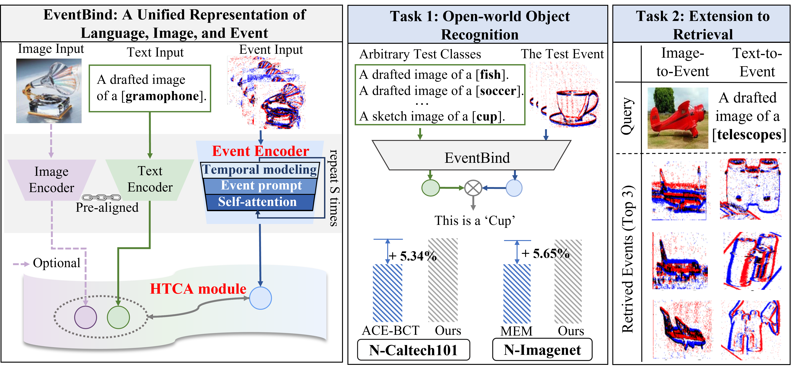

# [🌟ECCV2024 Highlight🌟]EventBind: Learning a Unified Representation to Bind Them All for Event-based Open-world Understanding

This repository contains the official PyTorch implementation of the paper "[EventBind: Learning a Unified Representation to Bind Them All for Event-based Open-world Understanding](https://vlislab22.github.io/EventBind/)" paper.
<div align="center">

</div>

---
# Citation
If you find this paper useful, please consider staring 🌟 this repo and citing 📑 our paper:

```
@article{zhou2023clip,
  title={E-CLIP: Towards Label-efficient Event-based Open-world Understanding by CLIP},
  author={Zhou, Jiazhou and Zheng, Xu and Lyu, Yuanhuiyi and Wang, Lin},
  journal={arXiv e-prints},
  pages={arXiv--2308},
  year={2023}
}
```
---
# Quick Start
1. Refer to [install.md](./docs/install.md) for step-by-step guidance on how to install the packages.
2. Download the **ViT-B-32**, **ViT-B-16**, **ViT-L-14** CLIP pretrained backbone in this [repository](https://github.com/mlfoundations/open_clip).
3. Download the dataset and its corresponding model checkpoints in the following **Dataset** section and **Checkpoints** section, respectively.
Note that the train-val split for N-Caltech101/Caltech101 and N-MNIST/MNIST dataset are provided in [Dataloader](./Dataloader) folder to ensure the fairness of future comparison.
and we follow the N-Imagenet/Imagenet dataset's official train-val split.
4. Change settings of the **dataset_name.yaml** in the [Configs](./Configs) folder, which are emphasized by **TODO** notes.
5. Finally, train and evaluate the EventBind using the following command!
````
python ./EventBind/train_dp_dataset_name.py
````
---
# Checkpoints

<div align=center>

|   Datasets   |                                                                                                                                                                Access to Model checkpoints                                                                                                                                                                 | 
|:------------:|:----------------------------------------------------------------------------------------------------------------------------------------------------------------------------------------------------------------------------------------------------------------------------------------------------------------------------------------------------------:|
| N-Caltech101 |        [ViT-B-32](https://huggingface.co/garlandchou/EventBind/resolve/main/N-Caltech101-ViT-B-32.bin?download=true), [ViT-B-16](https://huggingface.co/garlandchou/EventBind/resolve/main/N-Caltech101-ViT-B-16.bin?download=true), [ViT-L-14](https://huggingface.co/garlandchou/EventBind/resolve/main/N-Caltech101-ViT-L-14.bin?download=true)         | 
|   N-MINIST   | [ViT-B-32](https://huggingface.co/garlandchou/EventBind/resolve/main/MINIST%20ViT-B-32.bin?download=true), [ViT-B-16](https://huggingface.co/garlandchou/EventBind/resolve/main/MINIST%20ViT-B-16.bin?download=true), [ViT-L-14](https://huggingface.co/garlandchou/EventBind/resolve/main/MINIST%20ViT-L-14.bin?download=true)                            | 
|  N-Imagenet  |        [ViT-B-32](https://huggingface.co/garlandchou/EventBind/resolve/main/N-Imagenet%20ViT-B-32.bin?download=true), [ViT-B-16](https://huggingface.co/garlandchou/EventBind/resolve/main/N-Imagenet%20ViT-B-16.bin?download=true), [ViT-L-14](https://huggingface.co/garlandchou/EventBind/resolve/main/N-Imagenet%20ViT-L-14.bin?download=true)         |

</div>

---
# Dataset
Please refer to the .txt files in the [Dataloader](./Dataloader) folder for the dataset structure.
<div align=center>

| Event Datasets |                                        Acesse to Download                                        | Corresponding Image Datasets |                              Acesse  to Download                               |
|:--------------:|:------------------------------------------------------------------------------------------------:|:----------------------------:|:------------------------------------------------------------------------------:|
|  N-Caltech101  |       [Download](https://drive.google.com/drive/folders/1sY91hL_iHnmfRXSTc058bfZ0GQcEC6St)       |          Caltech101          |            [Download](https://data.caltech.edu/records/mzrjq-6wc02)            |
|   N-Imagenet   | [Download](https://docs.google.com/document/d/1x0Vqe_5tVAJtYLYSZLwN6oNMExyUjIh-a30oLOKV2rE/edit) |           Imagenet           |                 [Download](https://image-net.org/download.php)                 |
|    N-MINIST    |                   [Download](https://www.garrickorchard.com/datasets/n-mnist)                    |        MINIST                | [Download](https://link.zhihu.com/?target=http%3A//yann.lecun.com/exdb/mnist/) |
</div>

---

# Dependencies
Please refer to [install.md](./docs/install.md) for step-by-step guidance on how to install the packages.

---
# ️ ️Acknowledgement
We thank the authors of [CLIP](https://github.com/openai/CLIP), [CoOp](https://github.com/KaiyangZhou/Dassl.pytorch) for opening source their wonderful works.

---
# License
This repository is released under the [MIT](./LICENSE) License.

---
# Contact
If you have any question about this project, please feel free to contact jiazhouzhou@hkust-gz.edu.cn.
