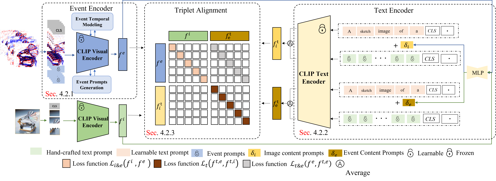

# E-CLIP: Towards Label-efficient Event-based Open-world Understanding by CLIP

This repository contains the official PyTorch implementation of the paper "E-CLIP: Towards Label-efficient Event-based Open-world Understanding by CLIP" paper.
<div align="center">

</div>

**The codes and checkpoints will be released ASAP after the paper's decision.**

---
# Citation
If you find this paper useful, please consider staring 🌟 this repo and citing 📑 our paper:

```
 @article{zhou2023clip,
  title={E-CLIP: Towards Label-efficient Event-based Open-world Understanding by CLIP},
  author={Zhou, Jiazhou and Zheng, Xu and Lyu, Yuanhuiyi and Wang, Lin},
  journal={arXiv preprint arXiv:2308.03135},
  year={2023}
}
```
---
# Dataset
<div align=center>

| Event Datasets |                                        Acesse to Download                                        | Corresponding Image Dataset | Acesse to Download |
|:--------------:|:------------------------------------------------------------------------------------------------:|:---------------------------:|:------------------:|
|  N-Caltech101  |       [Download](https://drive.google.com/drive/folders/1sY91hL_iHnmfRXSTc058bfZ0GQcEC6St)       |         Caltech101          |    [download]()    |
|   N-Imagenet   | [Download](https://drive.google.com/drive/folders/18EXLWvCCQMRBd7-n6uznBUHdP4uC6Q15?usp=sharing) |Imagenet| [download]()|
|    N-MINIST    | [Download](https://drive.google.com/drive/folders/18EXLWvCCQMRBd7-n6uznBUHdP4uC6Q15?usp=sharing) |MINIST| [download]()|
</div>

---
# Dependencies
Please refer to [install.md](./docs/install.md) for step-by-step guidance on how to install the packages.

---
# ️ ️Acknowledgement
We thank the authors of [CLIP](https://github.com/openai/CLIP) for opening source their wonderful works.

---
# License
This repository is released under the [MIT](./LICENSE) License.
